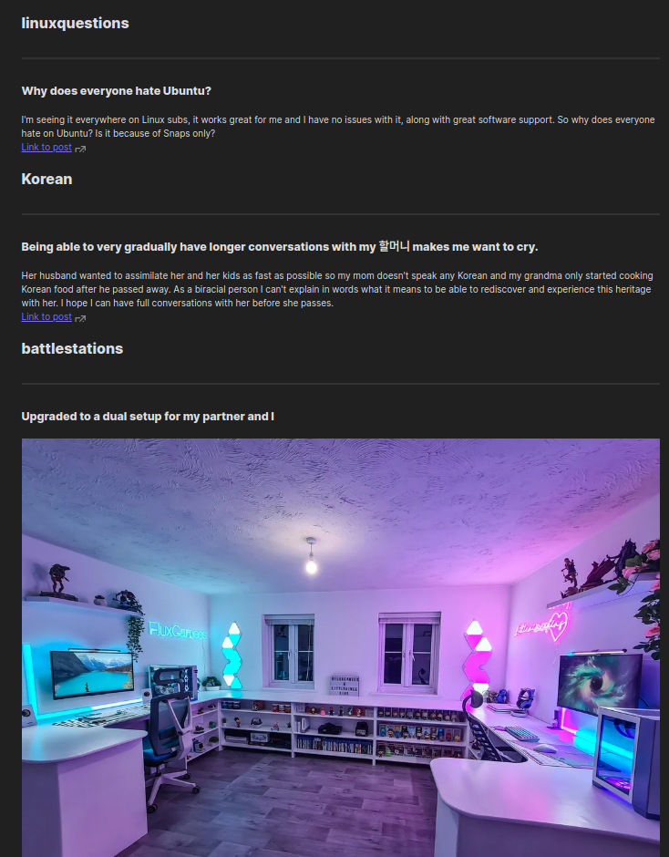

# Reddit Weekly Newsletter

## Introduction

It's a small pet project to catchup on weekly top post from subreddit a user follows.
I made it basically to catchup on my domains of interest and what's been 'hot' this week in it.
Why markdown? 
Because I generally store my notes and information in md files and they are quite simple to access and use
without any special editors or apps

## Screenshot

Since Reddit posts are markdown friendly, codes, images, indentation and the format the OP intended is preserved implicitly.



## Technology

- Python 3.8.10
- python module `praw`

## Setup Guide

1. You can use any Python3.6+ version and setup a virtual environment to install python dependent packages
   ```
   # On Debian/Ubuntu based systems install virtual environment creation package and python package manager pip (if not already installed.)
   sudo apt-get install virtualenv python3-pip
   # Create a python 3 virtual environment
   virtualenv -p python3 .venv
   # Activate it
   source .venv/bin/activate
   # Install packages
   pip install -r requirements.txt
   ```

2.  To access Reddit user data and API one needs to create an app, you can follow the official guide as mentioned [here](https://github.com/reddit-archive/reddit/wiki/OAuth2-Quick-Start-Example#first-steps).

3. We use [PRAW](https://github.com/praw-dev/praw) to interact with Reddit's API, its a python wrapper made upon raw reddit's API , it also handles `rate-limit` of reddit implicitly. we use `praw.ini` configuration file([more info here](https://praw.readthedocs.io/en/stable/getting_started/configuration/prawini.html)) to store our reddit account that.

Format of praw.ini in your $PROJECT_FOLDER
```
[WeeklyNewsletter]
client_id = <your app id>
client_secret = <your app client secret>
app_name = weekly-newsletter
app_author = _niarch
username = <your username for the account  with which you created the app>
password = <your account password>
app_version = 1.0
user_agent = script:%(app_name)s:v%(app_version)s (by u/%(app_author)s))
```
4. Create 2 empty folders `data/` and `logs/` for debugging and logging purpose.
5. Add the following line to your cronjob `source ./venv/bin/activate && python src/main.py`

## Credits

- @KalleHallden's youtube video gave me the idea to make use of Reddit's API
- @praw-dev for an easy to use API